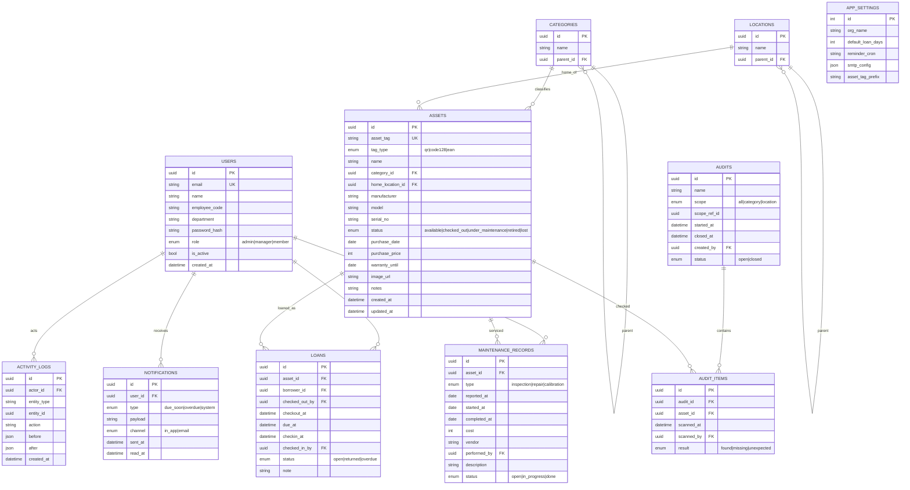
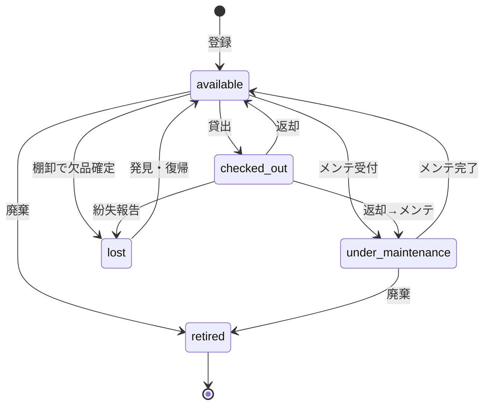
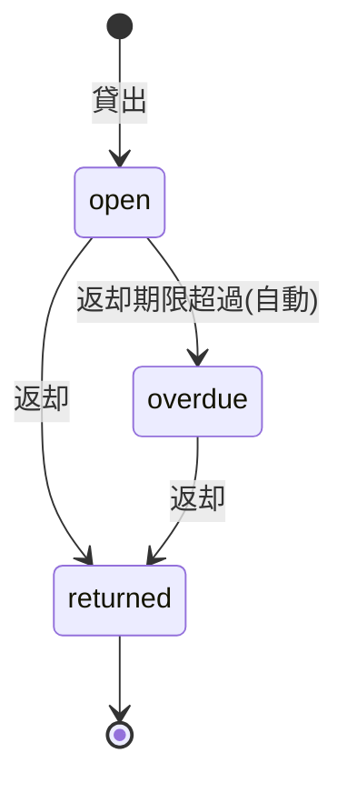
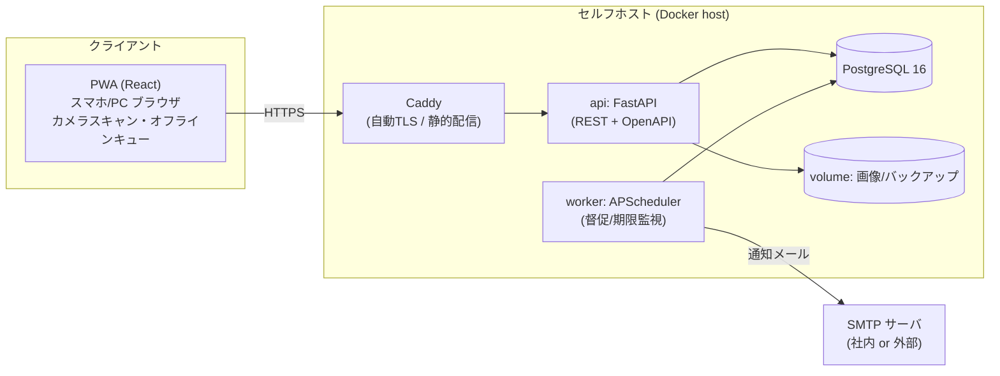

# Karidasu — 備品・資産 貸出/管理システム 設計書

> **キャッチコピー**: 「QRをかざすだけの、社内備品・資産の貸出/返却・棚卸管理」
> **リポジトリ名（想定）**: `karidasu`
> **対象規模**: スモールビジネス〜中小企業の備品・会社資産管理（数十〜数千点 / 数名〜数百ユーザー）
> **配布形態**: オープンソース / Docker によるセルフホスト
> **ステータス**: 要件定義 → 詳細設計（v1.0 / MVP）
> **作成**: PM（要件定義〜詳細設計）

---

## 0. 改訂履歴

| 版 | 日付 | 内容 |
|----|------|------|
| 0.1 | 初版 | 競合調査・要件ヒアリング結果を反映し、要件定義〜詳細設計を確定 |

---

## 1. 背景・目的

### 1.1 背景
社内のPC・周辺機器・工具・撮影機材・社用品などの「個体管理が必要な備品/資産」を、Excelや紙の貸出簿で管理している組織は多い。これらは次の課題を抱えやすい。

- 「いま誰が何を借りているか」がリアルタイムに分からない
- 返却忘れ・所在不明（紛失）が発生する
- 棚卸が手作業で時間がかかり、台帳と現物が乖離する
- メンテナンス・修理の履歴が残らず、買い替え判断ができない

### 1.2 目的
**スマホでQR/バーコードをかざすだけで、貸出・返却・棚卸が完了する**軽量な備品/資産管理システムを、セルフホスト可能なOSSとして提供する。導入の手軽さ（Docker一発）とモバイル現場入力体験を最優先とする。

### 1.3 ゴール（成功指標 / KPI）
| 指標 | 目標 |
|------|------|
| 1件の貸出操作に要する時間 | 5秒以内（スキャン→確定） |
| 棚卸の所要時間 | 現物スキャンのみで完了（台帳照合は自動） |
| 初回セットアップ時間 | `docker compose up` から10分以内に利用開始 |
| 返却遅延の検知 | 期限超過を自動でアラート/督促 |

---

## 2. 競合調査と差別化（Positioning）

### 2.1 有償（SaaS）
| 製品 | 形態 | 価格感 | 特徴 / 弱点 |
|------|------|--------|-------------|
| **Sortly** | クラウドSaaS | 無料(1ユーザー/100点)〜月$49〜$149 | 写真・QR・フォルダ整理が強い。アイテム増で価格が急騰、API/連携が弱い、**セルフホスト不可** |
| Asset Panda / Thrive / Acctivate / MRPeasy | クラウドSaaS | 月$49〜 / 要問い合わせ | 高機能だがコスト高・国内向けでない |

### 2.2 無償・オープンソース（セルフホスト）
| 製品 | 主用途 | 弱点（本プロダクトの突破口） |
|------|--------|------------------------------|
| **Snipe-IT** | IT資産管理（貸出/返却あり） | LAMP前提でセットアップが重い。UIがデスクトップ寄りで**モバイルスキャン体験が弱い** |
| **GLPI** | IT資産 + ITSM | 多機能ゆえ重い・DBチューニング必須・備品管理には過剰 |
| InvenTree / PartKeepr | 部品/電子部品 | 部品在庫向けで「個体貸出」用途ではない |
| Grocy | 家庭/消耗品 | 資産の個体・貸出管理ではない |
| Odoo / ERPNext / Dolibarr | フルERP | 会社備品レベルには過剰・学習コスト大 |

### 2.3 差別化の結論（作る価値）
正面の汎用在庫管理は完成品が多く価値は低い。しかし以下の**すき間**は明確に存在し、作る価値がある。

1. **モバイル/QRファースト** — Snipe-IT・GLPIは管理画面が主役。本プロダクトは「スマホでQRをかざす」を主役UIに据える（PWA・カメラスキャン・オフライン対応）。
2. **導入の手軽さ** — `docker compose up` 一発、外部依存最小。
3. **「貸出/返却 + 棚卸」に特化** — ITSMやERPの巨大機能を持たず、備品の個体追跡に絞って軽量・高速。
4. **日本語ファースト** — UI/帳票/CSVを国内業務にフィット。

> **一言で**: *「Snipe-ITの軽量版を、スマホのQRスキャン体験に振り切ったもの」*

---

## 3. スコープ

### 3.1 v1.0（MVP）で実装する機能
1. **資産マスタ管理**（個体登録・カテゴリ・保管場所・写真）
2. **貸出 / 返却**（誰が・いつから・返却期限、自己貸出＆代理貸出）
3. **QR/バーコード ラベルの発行・印刷**（ラベルシートPDF出力）
4. **棚卸**（一括スキャンで台帳と現物を自動照合）
5. **返却期限アラート / 督促**（自動通知：アプリ内 + メール）
6. **メンテナンス / 修理履歴**（点検・修理・校正の記録）
7. **レポート / CSVエクスポート**（在庫一覧・貸出状況・棚卸結果・履歴）
8. **認証・ユーザー/権限管理**（全員ログイン制、RBAC）

### 3.2 スコープ外（v1.0では実装しない）
- 消耗品の数量在庫管理（入出庫の数量増減）→ v2 で検討
- 発注/購買ワークフロー、会計連携
- SSO/LDAP/SAML、マルチテナント（SaaS化）
- ネイティブモバイルアプリ（PWAで代替）
- 自動ディスカバリ（エージェントによる機器自動収集）

---

## 4. 想定ユーザー（ペルソナ）と役割

| ロール | 説明 | 主な操作 |
|--------|------|----------|
| **Admin（管理者）** | システム設定・全権限 | ユーザー管理、設定、全データCRUD |
| **Manager（資産管理担当）** | 備品の管理者・総務/情シス | 資産登録、ラベル発行、棚卸主催、代理貸出、メンテ記録、レポート |
| **Member（一般利用者）** | 備品を借りる従業員 | QRスキャンで自己貸出/返却、自分の貸出一覧の確認 |

> 認証方式: **全員がアカウントを持ちログイン**。Memberはスマホでログイン後、資産QRをスキャンして自分名義で貸出/返却する。

---

## 5. 要件定義

### 5.1 機能要件（FR）

#### FR-1 認証・ユーザー管理
- FR-1.1 メールアドレス + パスワードでログインする。
- FR-1.2 JWT（アクセストークン + リフレッシュトークン）でセッションを維持する。
- FR-1.3 Admin はユーザーの作成・無効化・ロール変更ができる。
- FR-1.4 パスワードは Argon2id でハッシュ化して保存する。
- FR-1.5 ユーザーは `氏名 / メール / 社員コード / 部署 / ロール` を持つ。

#### FR-2 資産マスタ
- FR-2.1 資産を個体単位で登録する（1個体 = 1レコード = 1ラベル）。
- FR-2.2 属性: `管理番号(asset_tag) / 名称 / カテゴリ / 保管場所(ホーム) / メーカー / 型番 / シリアル番号 / 取得日 / 取得価格 / 保証期限 / 写真 / 備考`。
- FR-2.3 `管理番号(asset_tag)` は一意。未指定時は自動採番（プレフィックス + 連番）。
- FR-2.4 状態(status): `利用可(available) / 貸出中(checked_out) / メンテ中(under_maintenance) / 廃棄(retired) / 紛失(lost)`。
- FR-2.5 カテゴリ・保管場所は階層（親子）を持てる。
- FR-2.6 `GET /assets/lookup?tag=...` でQR値から資産を即時特定できる（スキャンの中核）。

#### FR-3 貸出 / 返却
- FR-3.1 利用可の資産をスキャンし、自分名義で**貸出**する（借りた人・貸出日時・返却期限）。
- FR-3.2 Manager は他ユーザーを指定して**代理貸出**できる。
- FR-3.3 返却期限は「既定日数」から自動計算、手動変更可。
- FR-3.4 貸出中の資産をスキャンして**返却**する（返却日時・操作者を記録）。
- FR-3.5 貸出/返却のたびに資産 status を遷移させる。
- FR-3.6 同一資産は二重貸出できない（排他制御）。
- FR-3.7 貸出履歴は資産・ユーザー双方から参照できる。

#### FR-4 QR/バーコードラベル
- FR-4.1 資産1件または複数選択からラベルを発行する。
- FR-4.2 ラベル内容: QRコード（asset_tag をエンコード） + 管理番号 + 名称（任意）。
- FR-4.3 市販ラベルシート（例: A-one 65面など）レイアウトのPDFを出力する。
- FR-4.4 既存バーコード（資産本体の製品バーコード）を asset_tag として登録・運用も可能（コード種別: QR / CODE128 / EAN）。

#### FR-5 棚卸
- FR-5.1 棚卸セッションを作成する（対象範囲: 全体 / カテゴリ / 保管場所）。
- FR-5.2 現物のQRを次々スキャンして「発見」を記録する。
- FR-5.3 スキャン結果を台帳と自動照合し、`発見 / 未発見(欠品) / 想定外(別場所)` を判定する。
- FR-5.4 棚卸セッションを締めて結果レポートを確定・出力する。
- FR-5.5 オフラインでスキャンし、オンライン復帰時に一括同期できる（PWA）。

#### FR-6 アラート / 督促
- FR-6.1 返却期限の前日・当日・超過時に自動通知する（スケジュール実行）。
- FR-6.2 通知チャネル: アプリ内通知 + メール（SMTP）。
- FR-6.3 通知タイミング・文面は設定で変更できる。
- FR-6.4 Manager は超過中の貸出一覧をダッシュボードで確認できる。

#### FR-7 メンテナンス / 修理履歴
- FR-7.1 資産に対して `点検 / 修理 / 校正` の記録を追加する。
- FR-7.2 属性: `種別 / 受付日 / 開始日 / 完了日 / 費用 / 業者 / 実施者 / 内容 / 状態`。
- FR-7.3 メンテ受付中は資産 status を `メンテ中` に遷移させ、貸出不可とする。
- FR-7.4 資産詳細からメンテ履歴を時系列で参照できる。

#### FR-8 レポート / エクスポート
- FR-8.1 在庫一覧・貸出状況・棚卸結果・操作履歴をCSV（UTF-8 BOM, Excel互換）で出力する。
- FR-8.2 CSVインポートで資産マスタを一括登録できる（テンプレート提供）。
- FR-8.3 ダッシュボードで主要KPIを可視化（総資産数・貸出中・期限超過・メンテ中）。

#### FR-9 監査ログ（操作履歴）
- FR-9.1 主要な変更操作（貸出/返却/登録/更新/廃棄/棚卸）を `誰が・いつ・何を・前後値` で記録する。
- FR-9.2 ログは改ざんを避けるため追記専用（更新・削除不可）とする。

### 5.2 非機能要件（NFR）

| 区分 | 要件 |
|------|------|
| **性能** | スキャン照合 API は p95 < 300ms。一覧は1万件でもページング/索引で応答 < 1s。 |
| **可用性** | 単一ホスト構成を基本。DBバックアップ手順（pg_dump + cron）を同梱。 |
| **セキュリティ** | HTTPS必須（Caddyで自動TLS）。OWASP ASVS L1相当。JWT・CSRF/CORS対策・レート制限・入力検証・SQLはORMでパラメータ化。 |
| **オフライン** | PWAでスキャン操作をローカルキューに退避し、復帰時に同期（特に棚卸）。 |
| **国際化** | 既定 `ja`、`en` 切替可能（i18nキー方式）。日時はタイムゾーン対応。 |
| **アクセシビリティ** | WCAG 2.1 AA を目標。キーボード操作・コントラスト確保。 |
| **可搬性** | x86_64 / arm64 の両Dockerイメージを提供。 |
| **保守性** | API/型をOpenAPIで自動生成・公開。テストカバレッジ目標 70%+。 |
| **ライセンス** | 後述（§13）。SaaS無断再販を抑止しつつ自己ホストを促す **AGPL-3.0** を推奨。 |

---

## 6. ユースケース

### 6.1 主要ユースケース一覧
| ID | アクター | ユースケース |
|----|----------|--------------|
| UC-1 | Member | スマホで資産QRをスキャンして自己貸出する |
| UC-2 | Member | 借用中の資産を返却する |
| UC-3 | Manager | 資産を登録しQRラベルを発行・貼付する |
| UC-4 | Manager | 棚卸を主催し、現物スキャンで台帳照合する |
| UC-5 | Manager | メンテ受付を登録し、完了後に利用可へ戻す |
| UC-6 | System | 返却期限を監視し、期限前後で督促通知する |
| UC-7 | Manager | 貸出状況/棚卸結果をCSV出力する |

### 6.2 代表シナリオ（UC-1: 自己貸出）
1. Member がスマホでログインし「スキャン」をタップ。
2. カメラで資産のQRを読み取る → `GET /assets/lookup?tag=` で資産特定。
3. 資産が「利用可」なら貸出フォーム表示（借りる人=自分、返却期限=既定）。
4. 「貸出する」をタップ → `POST /loans` で貸出生成、資産 status を `貸出中` に。
5. 成功トースト表示。オフライン時はキューに退避し後で同期。

**例外**: 既に貸出中 → エラー表示（現在の借用者を提示）。メンテ中/廃棄 → 貸出不可を表示。

---

## 7. ドメインモデル / データ設計

### 7.1 ER図



### 7.2 主要エンティティ補足
- **ASSETS.asset_tag**: QR/バーコードにエンコードされる実体。物理ラベルの一意キー。
- **LOANS**: 1資産につき同時に `status=open` は1件のみ（部分一意インデックスで担保）。
- **AUDIT_ITEMS.result=unexpected**: 対象範囲外の資産がスキャンされた場合（別場所からの混入）。
- **ACTIVITY_LOGS**: 追記専用。before/after はJSONで差分保持。

### 7.3 状態遷移

#### 資産ステータス


#### 貸出ライフサイクル


---

## 8. システムアーキテクチャ

### 8.1 推奨技術スタック（おまかせ提案）

| レイヤ | 採用技術 | 採用理由 |
|--------|----------|----------|
| **フロントエンド** | React 18 + TypeScript + Vite、**PWA**（Service Worker / IndexedDB） | モバイル・オフライン・カメラスキャンに最適。型安全。 |
| UIライブラリ | MUI（Material UI）または Tailwind + Headless UI | モバイル最適なコンポーネント、ja対応容易。 |
| スキャナ | `@zxing/browser`（QR/CODE128/EAN対応） | ブラウザカメラで多様なコード対応、追加ハード不要。 |
| **バックエンド** | **Python 3.12 + FastAPI**、SQLAlchemy 2.0 + Alembic、Pydantic v2 | 軽量・高速・OpenAPI自動生成。Docker化容易。 |
| 認証 | JWT（access+refresh）、Argon2id、python-jose / passlib | 標準的でセルフホスト向き。 |
| **データベース** | **PostgreSQL 16** | 信頼性・JSON/部分インデックス・全文検索。 |
| 非同期/定期実行 | APScheduler（worker コンテナ） | 督促のスケジュール実行を軽量に実現（Celery/Redis不要）。 |
| ラベル/PDF | `segno`（QR生成） + `weasyprint` または `reportlab`（ラベルPDF） | 市販ラベルシート面付けに対応。 |
| メール | SMTP（aiosmtplib） | 既存メール基盤に乗せられる。 |
| **リバースプロキシ** | Caddy（自動TLS） | 設定最小でHTTPS化。nginxも可。 |
| 配布 | Docker / docker-compose（x86_64 / arm64） | `docker compose up` 一発。 |
| CI/テスト | GitHub Actions、pytest、Vitest、Playwright | 品質担保。 |

> 代替案: Node/TypeScript 統一（NestJS + Prisma）や PHP/Laravel（Snipe-IT同系統で資料豊富）も選択可能。本書は **FastAPI 構成**を前提に詳細設計する（軽量・OpenAPI親和性・型生成の容易さを重視）。

### 8.2 コンテナ構成



### 8.3 docker-compose（雛形）
```yaml
services:
  proxy:
    image: caddy:2
    ports: ["80:80", "443:443"]
    volumes:
      - ./Caddyfile:/etc/caddy/Caddyfile
      - caddy_data:/data
    depends_on: [api]

  api:
    image: ghcr.io/<org>/karidasu-api:latest
    environment:
      DATABASE_URL: postgresql+psycopg://app:app@db:5432/karidasu
      JWT_SECRET: ${JWT_SECRET}
      DEFAULT_LOAN_DAYS: "14"
    depends_on: [db]
    volumes: ["app_media:/app/media"]

  worker:
    image: ghcr.io/<org>/karidasu-api:latest
    command: ["python", "-m", "app.worker"]
    environment:
      DATABASE_URL: postgresql+psycopg://app:app@db:5432/karidasu
      SMTP_URL: ${SMTP_URL}
    depends_on: [db]

  db:
    image: postgres:16
    environment:
      POSTGRES_USER: app
      POSTGRES_PASSWORD: app
      POSTGRES_DB: karidasu
    volumes: ["db_data:/var/lib/postgresql/data"]

volumes:
  caddy_data: {}
  db_data: {}
  app_media: {}
```

---

## 9. API設計（REST / OpenAPI）

### 9.1 共通仕様
- ベースURL: `/api/v1`
- 認証: `Authorization: Bearer <access_token>`
- 形式: JSON。エラーは `{ "error": { "code": "...", "message": "..." } }`。
- ページング: `?page=&size=`、レスポンスに `total / page / size`。
- 監査: 変更系は ACTIVITY_LOGS に自動記録。

### 9.2 エンドポイント一覧

| メソッド | パス | 概要 | 権限 |
|----------|------|------|------|
| POST | `/auth/login` | ログイン（access/refresh発行） | 全員 |
| POST | `/auth/refresh` | トークン更新 | 全員 |
| GET | `/auth/me` | 自分の情報 | 全員 |
| GET/POST | `/users` | ユーザー一覧/作成 | admin |
| PATCH | `/users/{id}` | 更新/無効化/ロール変更 | admin |
| GET/POST | `/assets` | 資産一覧/登録 | 一覧:全員 / 登録:manager |
| GET/PATCH/DELETE | `/assets/{id}` | 資産詳細/更新/廃棄 | 参照:全員 / 変更:manager |
| GET | `/assets/lookup?tag=` | **スキャン用：タグから即時特定** | 全員 |
| POST | `/assets/{id}/checkout` | 貸出（borrower指定可） | member(自分)/manager(代理) |
| POST | `/assets/{id}/checkin` | 返却 | member/manager |
| GET | `/loans` | 貸出一覧（自分/全体/超過フィルタ） | self/manager |
| GET/POST | `/categories`,`/locations` | マスタ管理 | 参照:全員 / 変更:manager |
| POST | `/labels` | ラベルPDF生成（asset_ids, layout） | manager |
| GET/POST | `/audits` | 棚卸一覧/作成 | manager |
| POST | `/audits/{id}/scan` | 棚卸スキャン登録（複数可） | manager |
| POST | `/audits/{id}/close` | 棚卸締め・確定 | manager |
| GET/POST | `/maintenance` | メンテ一覧/受付 | manager |
| PATCH | `/maintenance/{id}` | 進捗更新/完了 | manager |
| GET | `/reports/{type}.csv` | CSVエクスポート | manager |
| POST | `/imports/assets` | CSVインポート | manager |
| GET | `/notifications` | 自分の通知一覧 | 全員 |
| GET | `/dashboard` | KPIサマリ | 全員 |

### 9.3 主要リクエスト/レスポンス例

**貸出**
```http
POST /api/v1/assets/{id}/checkout
{
  "borrower_id": "self",          // 代理時はユーザーID
  "due_at": "2026-07-05T18:00:00+09:00",  // 省略時は既定日数で自動
  "note": "出張で持ち出し"
}
→ 201
{
  "loan_id": "…", "asset_id": "…", "status": "open",
  "borrower": {"id":"…","name":"山田太郎"},
  "due_at": "2026-07-05T18:00:00+09:00"
}
```
**スキャン特定**
```http
GET /api/v1/assets/lookup?tag=KRD-000123
→ 200
{ "id":"…","asset_tag":"KRD-000123","name":"ノートPC Dell XPS",
  "status":"available","current_loan":null }
```
**エラー（二重貸出）**
```http
→ 409 { "error": { "code": "ASSET_ALREADY_CHECKED_OUT",
        "message":"この資産は田中花子さんが貸出中です" } }
```

### 9.4 同時実行・整合性
- 貸出は `assets.status` を条件付き更新（`WHERE status='available'`）＋ `loans` の部分一意インデックス（`asset_id WHERE status='open'`）で二重貸出を防止。
- 競合時は 409 を返し、クライアントは再取得して再表示。

---

## 10. 画面設計（UI/UX）

### 10.1 画面一覧
| 画面 | 主目的 | 主対象 |
|------|--------|--------|
| ログイン | 認証 | 全員 |
| **スキャン（ホーム）** | カメラ起動→貸出/返却/棚卸の起点 | モバイル中心 |
| ダッシュボード | KPIと自分の貸出状況 | 全員 |
| 資産一覧 / 詳細 | 検索・状態確認・履歴 | 全員/manager |
| 貸出/返却ダイアログ | スキャン後の確定操作 | 全員 |
| 棚卸モード | 連続スキャン・進捗・差分 | manager |
| ラベル発行 | 選択→PDF出力 | manager |
| メンテ管理 | 受付・進捗・完了 | manager |
| レポート/エクスポート | CSV・集計 | manager |
| 管理（ユーザー/マスタ/設定） | 運用管理 | admin/manager |

### 10.2 UX原則
- **スキャンを最上位の動線**に置く（ホーム＝カメラ）。1タップでカメラ起動。
- スキャン後は資産状態に応じて**次アクションを自動提示**（利用可→貸出 / 貸出中→返却）。
- 大きなタップ領域・片手操作・現場の明るさを考慮した高コントラスト。
- オフライン時は「保留中n件」を表示し、復帰で自動同期。

### 10.3 主要画面ワイヤー（概念）
```
[スキャン(ホーム)]                 [棚卸モード]
┌───────────────┐        ┌───────────────┐
│   📷 カメラ      │        │ 対象: 会議室A   進捗 12/40 │
│  QRをかざす      │        │ ┌───────────┐ │
│                │        │ │ 連続スキャン中…   │ │
│ [手入力で検索]   │        │ └───────────┘ │
└───────────────┘        │ 発見10 / 欠品2 / 想定外0 │
   ↓ スキャン成功            │ [一時停止] [締める]  │
┌───────────────┐        └───────────────┘
│ ノートPC XPS    │
│ 状態: 利用可     │
│ 返却期限 2026/07/05│
│ [貸出する]       │
└───────────────┘
```

---

## 11. セキュリティ設計
- **認証**: Argon2idパスワード、JWT（access短命・refresh回転）、ログイン試行レート制限。
- **認可**: RBAC（admin/manager/member）。Memberは自分の貸出/返却・参照のみ。サーバ側で必ず権限検証。
- **通信**: HTTPS必須（Caddy自動TLS）。HSTS有効。
- **入力**: Pydanticでバリデーション、ORMでSQLインジェクション対策、ファイルアップロードはMIME/サイズ制限。
- **CORS/CSRF**: 同一オリジン配信を基本。トークンはAuthorizationヘッダ運用でCSRF面を低減。
- **監査**: ACTIVITY_LOGSで変更操作を追跡（追記専用）。
- **シークレット**: `JWT_SECRET`・SMTP認証は環境変数 / `.env`（リポジトリにコミットしない）。
- **依存性**: Dependabot/`pip-audit`・`npm audit` をCIで実行。

---

## 12. 運用・デプロイ・テスト
- **デプロイ**: `git clone` → `.env` 設定 → `docker compose up -d`。初回に管理者作成ウィザード。
- **マイグレーション**: Alembic。コンテナ起動時に自動適用（オプション）。
- **バックアップ**: `pg_dump` を cron で日次取得し `app_media` 共々アーカイブ。リストア手順をREADMEに記載。
- **監視**: `/healthz`（liveness）・`/readyz`。ログは標準出力（Docker logs / 集約基盤へ）。
- **テスト方針**:
  - 単体: pytest（API/ドメインロジック）、Vitest（フロント）。
  - 結合: スキャン→貸出→返却→棚卸の主要フロー。
  - E2E: Playwright（モバイルエミュレーション・カメラはモック）。
  - 目標カバレッジ 70%+、主要ユースケースは必須。

---

## 13. OSSライセンス方針
| 候補 | 特性 | 評価 |
|------|------|------|
| **AGPL-3.0（推奨）** | ネットワーク提供時もソース公開義務。SaaS無断再販を抑止しつつ自己ホストは自由。 | 競合のSaaS化リスクを抑えつつコミュニティ還元を促す。Snipe-ITも同系。 |
| MIT / Apache-2.0 | 制約が緩く採用が広がりやすい。 | 商用クローズド再販を許す点に留意。 |

> 推奨: **AGPL-3.0**。コントリビューションを促し、改変版の囲い込みを防ぐ。CLA（コントリビュータ規約）と `CODE_OF_CONDUCT` / `CONTRIBUTING.md` を整備。

---

## 14. ロードマップ

| バージョン | 内容 |
|------------|------|
| **v1.0 (MVP)** | 本書スコープ全機能（資産・貸出/返却・QRラベル・棚卸・督促・メンテ・レポート・RBAC・PWA/オフライン） |
| v1.1 | 検索強化（全文/QRバルク）、ラベルテンプレ追加、Webhook通知（Slack/Teams） |
| v1.2 | 予約（貸出予約）、添付ファイル、ダッシュボード拡充 |
| v2.0 | 消耗品の数量在庫管理（入出庫・発注点）、SSO/LDAP、監査強化 |
| v2.x | マルチテナント/SaaS版（ホスティング）、ネイティブアプリ |

---

## 15. リスクと対応
| リスク | 影響 | 対応 |
|--------|------|------|
| Snipe-IT等との機能競合 | 採用が伸びない | モバイル/QR体験と導入容易性に振り切り、明確に差別化 |
| ブラウザカメラ精度・端末差 | スキャン失敗 | 手入力フォールバック、複数コード形式対応、ライト/ガイド枠UI |
| オフライン同期の競合 | データ不整合 | サーバ側で冪等＆条件付き更新、競合は409で再同期 |
| セルフホスト運用負荷 | 定着しない | ワンコマンド導入・自動バックアップ・分かりやすいREADME |
| OSSメンテ継続性 | 陳腐化 | テスト/CI整備、Issueテンプレ、ロードマップ公開でコミュニティ形成 |

---

## 16. 用語集
| 用語 | 定義 |
|------|------|
| 資産(Asset) | 個体管理する備品/機材の1個体 |
| 管理番号(asset_tag) | QR/バーコードにエンコードする一意キー |
| 貸出(Loan/Checkout) | 資産を利用者に割り当てる行為 |
| 返却(Checkin) | 貸出を解除する行為 |
| 棚卸(Audit) | 現物スキャンで台帳と現物を照合する作業 |
| 督促(Reminder) | 返却期限前後の自動通知 |

---

### 付録A: CSVテンプレート（資産インポート）
```
asset_tag,name,category,home_location,manufacturer,model,serial_no,purchase_date,purchase_price,warranty_until,notes
KRD-000123,ノートPC Dell XPS,PC,会議室A,Dell,XPS13,SN12345,2025-04-01,180000,2028-04-01,営業共用
```

### 付録B: 既定設定値
| 設定 | 既定 |
|------|------|
| 既定貸出日数 | 14日 |
| 督促タイミング | 期限前日 / 当日 / 超過後 毎日 |
| asset_tag プレフィックス | `KRD-` + 6桁連番 |
| 言語 | ja |
